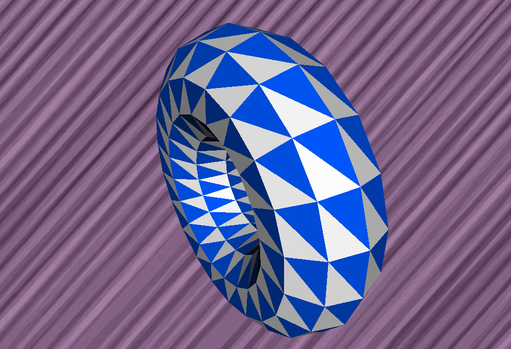
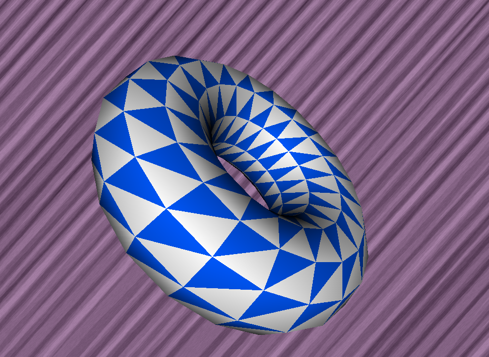
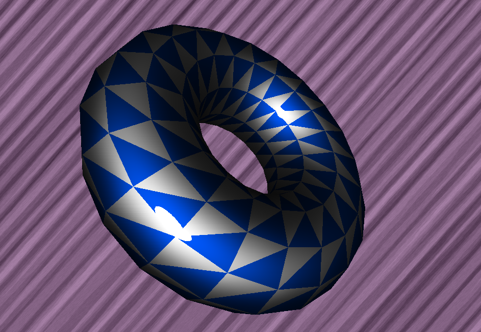
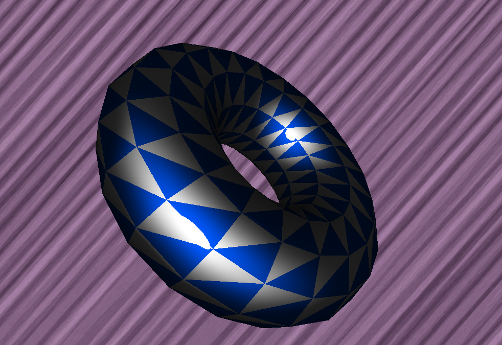

# sdl2 shading render 3D

Test of SDL2 to ckeck performance of solid flat shading.

Build:

To compile and debug in VSCode:

- Download SDL2 and place in the same include path that is related in c_cpp_properties.json and tasks.json
- Install g++ and configure path in vscode settings (or change c_cpp_properties and tasks.json)

Keys:

- Q-A: up & down
- O-P: left & right
- W-S: zoom out & in
- F: Flat 
- G: Gouraud
- H: Blinn Phong
- J: Phong

Demo results:

Flat Shading:

Gouraud Shading:

Blinn Phong Shading:

Phong Shading:

